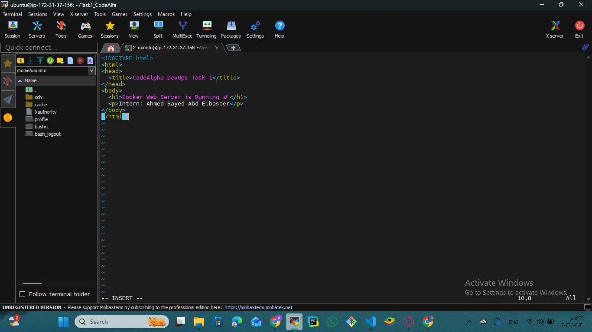
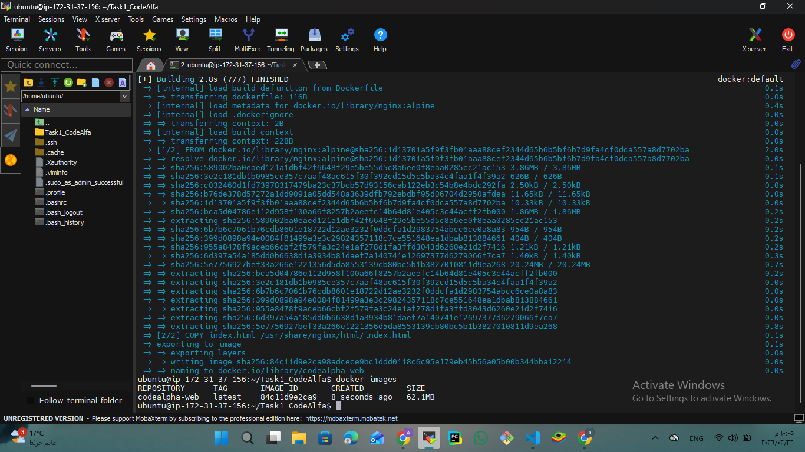
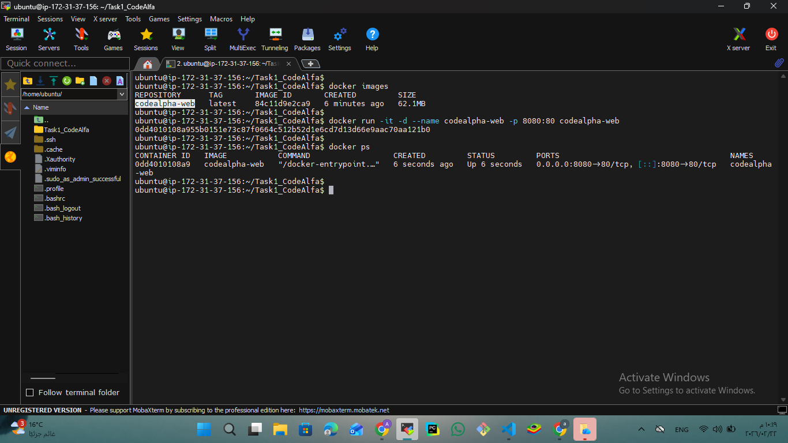
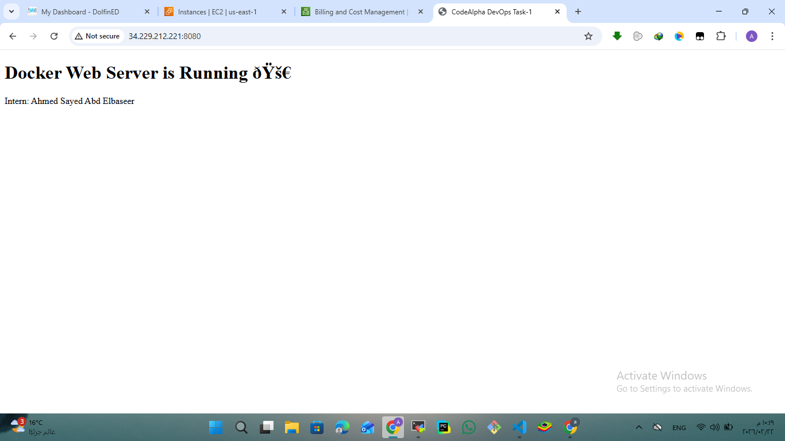
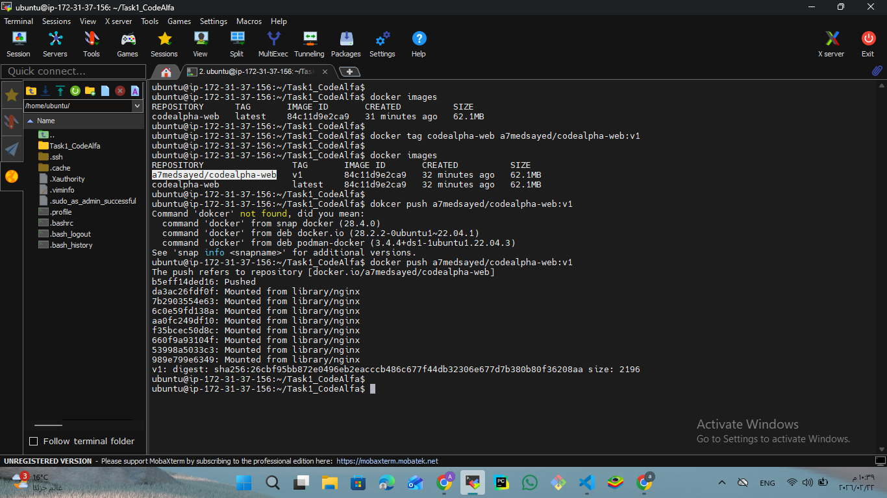
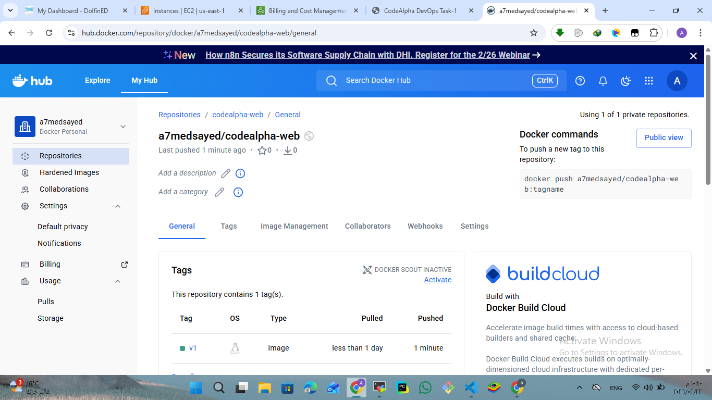

🚀 CodeAlpha Dockerized Web Server using Docker & Nginx

🧩 Overview
This project demonstrates how to dockerize a simple web server using Docker and deploy it as a containerized application using Nginx.
The project includes building a Docker image, running a container, pushing the image to Docker Hub, and verifying the application via a web browser.

## 🛠 Tools & Technologies
- Docker
- Nginx
- HTML
- Docker Hub

---

📁 Project Structure

CodeAlpha_Docker_WebServer/
├── index.html
├── Dockerfile
├── README.md
└── screenshots/
    ├── 01-html-code.png
    ├── 02-dockerfile.png
    ├── 03-build-image.png
    ├── 04-run-container.png
    ├── 05-access-web-server.png
    ├── 06-tag-and-push-image.png
    └── 07-image-in-dockerhub.png

---

⚙ Deployment Workflow

The following steps describe the complete workflow of dockerizing and deploying the web server.

---

📸 Project Screenshots

| Step | Description | Screenshot |
|------|------------|------------|
| 01 | HTML file used by the web server showing the confirmation message |  |
| 02 | Dockerfile configuration using Nginx as the base image |  |
| 03 | Building the Docker image from the Dockerfile using Docker CLI |  |
| 04 | Running the Docker container and verifying that it is active |  |
| 05 | Accessing the web application using public IP and port 8080 |  |
| 06 | Tagging the Docker image and pushing it to Docker Hub |  |
| 07 | Verifying the Docker image on Docker Hub via browser |  |

---

💡 Key Takeaways
- Dockerizing applications using Dockerfile.
- Running Nginx web server inside a Docker container.
- Publishing Docker images to Docker Hub.
- Accessing containerized services via browser.
- Practical understanding of Docker fundamentals.

---

▶ How to Run the Application

1. Make sure Docker is installed and running on your system.

2. Clone the repository:
   git clone https://github.com/your-username/CodeAlpha_Docker_WebServer.git
   cd CodeAlpha_Docker_WebServer

3. Build the Docker image using the Dockerfile:
   docker build -t codealpha-web .

4. Run the Docker container:
   docker run -d -p 8080:80 --name codealpha_container codealpha-web

5. Verify that the container is running:
   docker ps

6. Open your browser and access the application:
   http://<public-ip>:8080

You should see the message displayed on the page, confirming that the Dockerized web server is running successfully.

---

👤 Author

Ahmed Sayed Abd Elbaseer  
DevOps Intern – CodeAlpha  
[LinkedIn](https://www.linkedin.com/in/ahmed-sayed-devops-cloud) | [GitHub](https://github.com/ahmed-sayed-devops)

---

📜 License

This project is created for educational and internship purposes.