# 🚀 CodeAlpha Jenkins Remoting CI/CD Pipeline

## 🧩 Overview

This project demonstrates a **complete CI/CD pipeline using Jenkins with a remote AWS EC2 agent**.

The pipeline automatically builds, containerizes, and deploys a **Spring Boot application** using Docker.
The pipeline is triggered automatically using **GitHub Webhooks**, and notifications are sent to **Slack** after every build.

### Key Features

* Jenkins Controller + **Remote AWS EC2 Agent**
* Automated **CI/CD pipeline**
* **Maven build** for Java application
* **Docker image build & push** to Docker Hub
* **Automatic container deployment**
* **Slack notifications** for build status
* **GitHub Webhook integration**

---

# 🏗 Architecture

GitHub Push → Jenkins Pipeline → AWS EC2 Agent → Build (Maven) → Docker Image → DockerHub → Deploy Container → Slack Notification

---

# 📁 Project Structure

```
CodeAlpha_Jenkins_Remoting_CICD
│
├── src/main/java
├── Dockerfile
├── Jenkinsfile
├── pom.xml
└── README.md
```

---

# ⚙ CI/CD Pipeline Stages

The Jenkins pipeline performs the following steps:

1️⃣ Checkout source code from GitHub
2️⃣ Build the Java application using Maven
3️⃣ Build Docker image
4️⃣ Push Docker image to Docker Hub
5️⃣ Deploy the container
6️⃣ Send build notification to Slack

---

# 📸 Project Screenshots

| Step | Description                                                         | Screenshot                                                         |
| ---- | ------------------------------------------------------------------- | ------------------------------------------------------------------ |
| 1    | Jenkins agent successfully connected to controller                  | 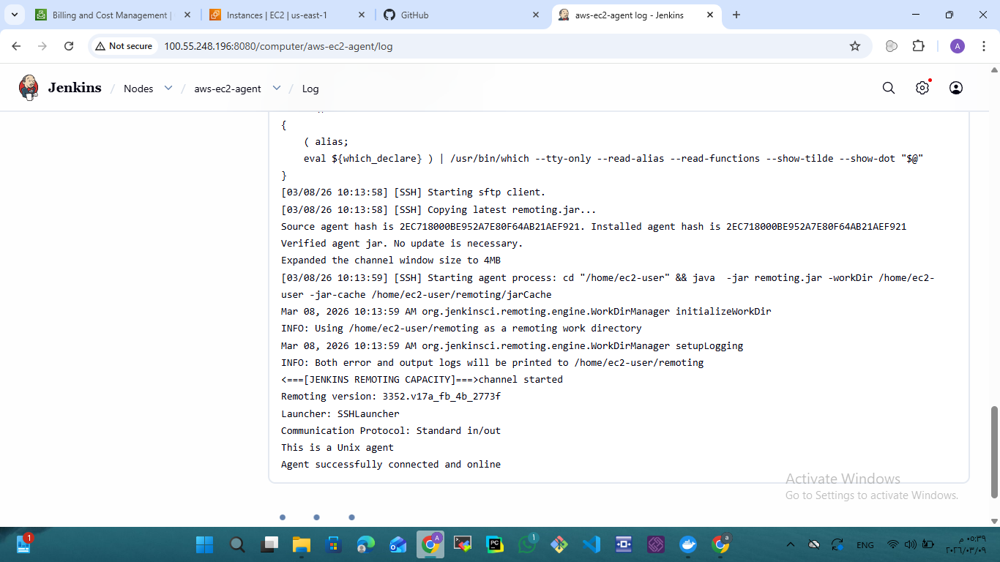                |
| 2    | Jenkins remoting connection log for the AWS EC2 agent               | 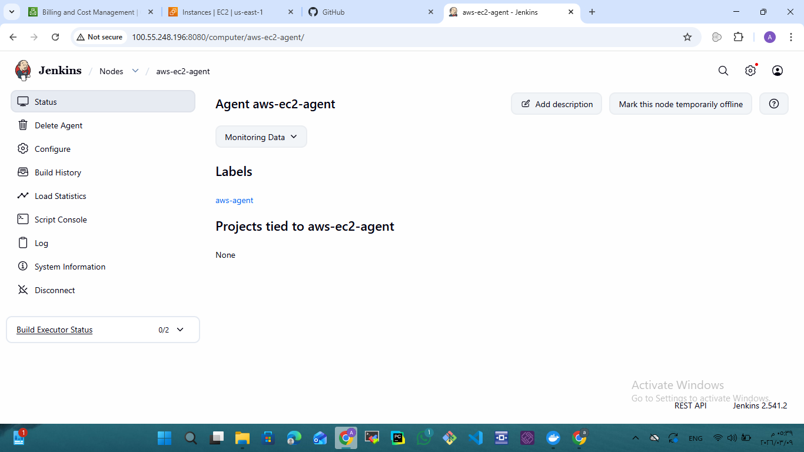              |
| 3    | Configured Jenkins credentials for GitHub, DockerHub, AWS and Slack | 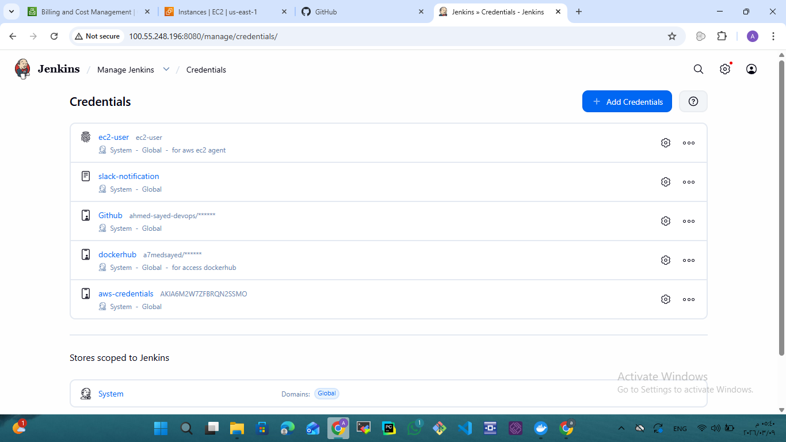                     |
| 4    | Jenkins pipeline configured with GitHub repository                  | 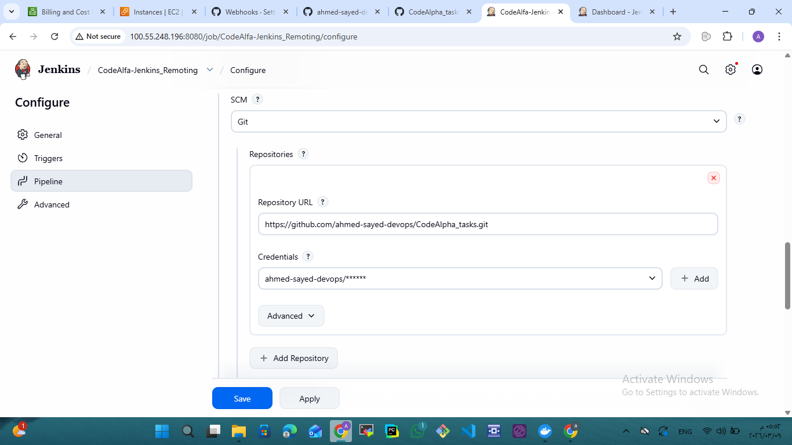          |
| 5    | Jenkins pipeline successfully created                               | 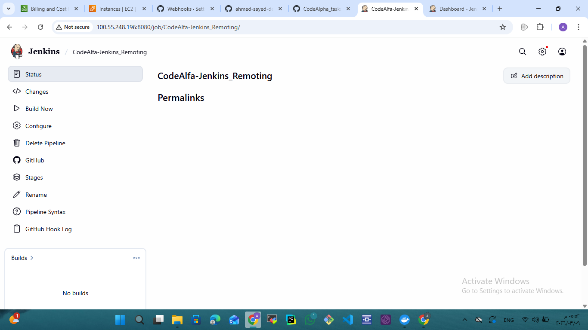           |
| 6    | GitHub webhook configuration pointing to Jenkins                    | 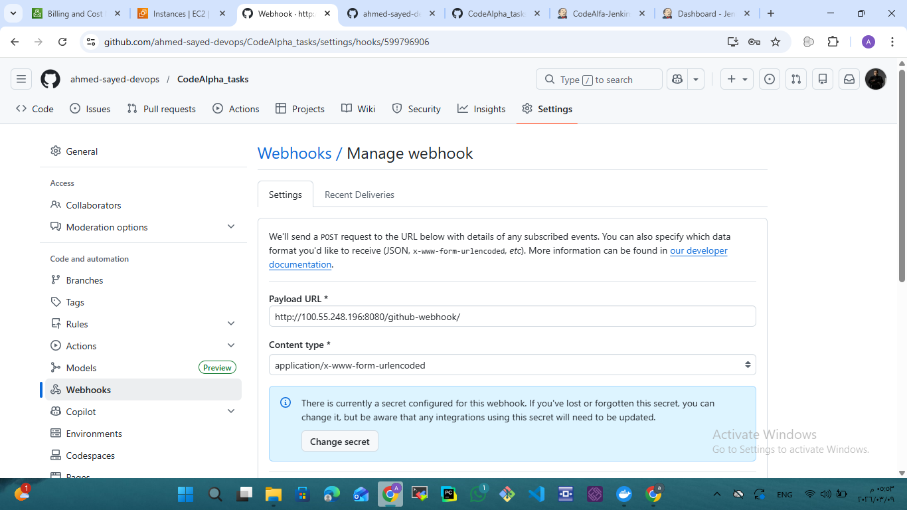          |
| 7    | Webhook successfully tested from GitHub                             | 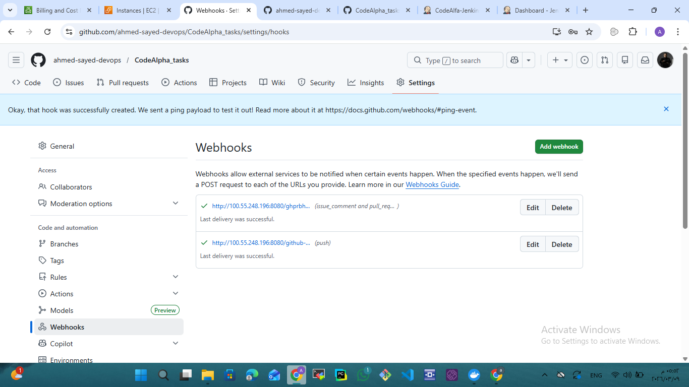                   |
| 8    | Jenkinsfile pushed to GitHub repository                             | 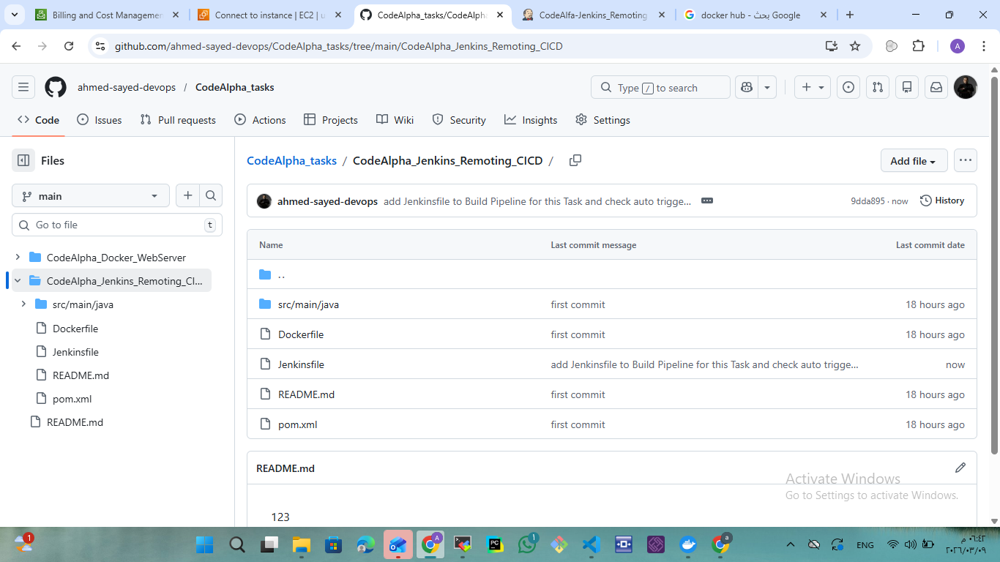           |
| 9    | Pipeline triggered automatically after GitHub push                  | 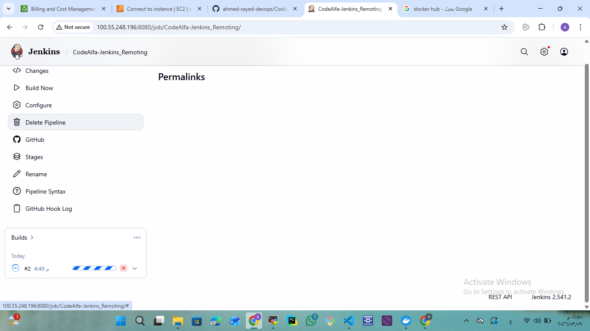             |
| 10   | Jenkins pipeline running                                            | 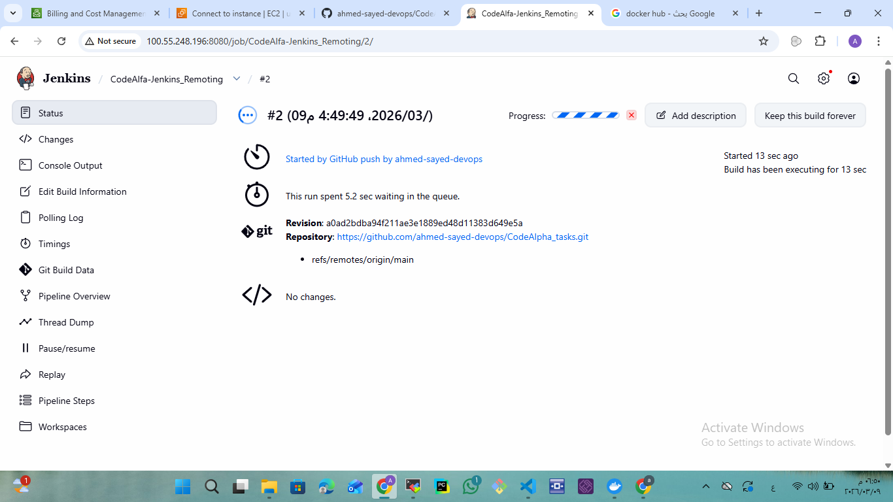      |
| 11   | Build scheduled on AWS EC2 Jenkins agent                            | 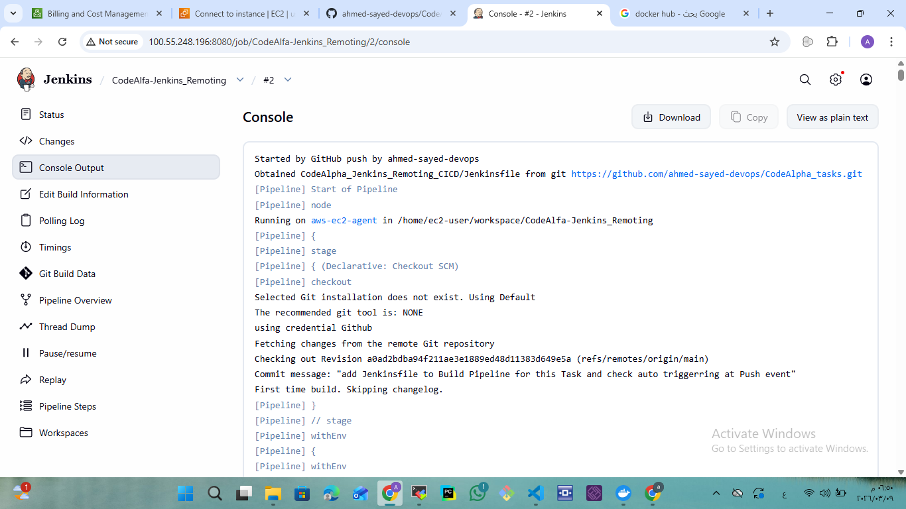 |
| 12   | Agent hostname verification inside pipeline                         | 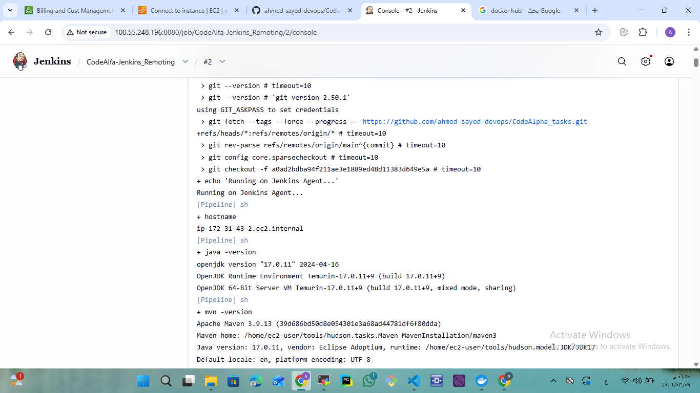               |
| 13   | Jenkins pipeline completed successfully                             | 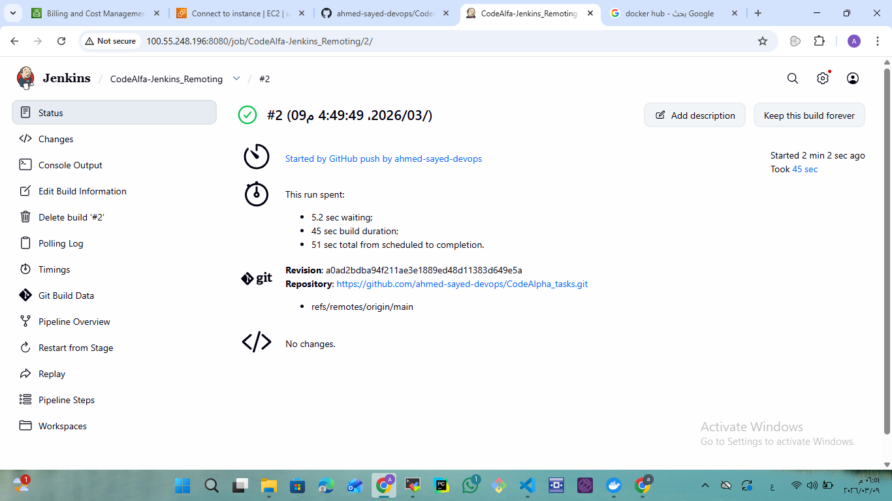           |
| 14   | Docker image pushed successfully to DockerHub                       | 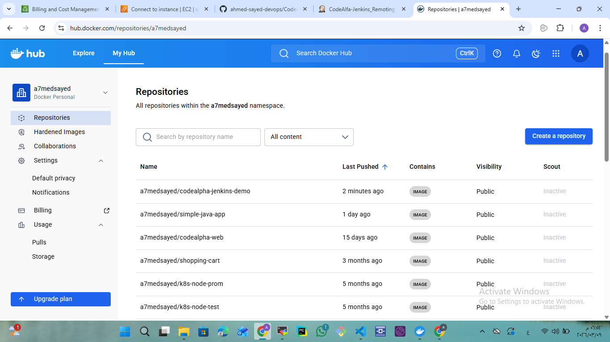                    |
| 15   | Docker image versions visible in DockerHub repository               | 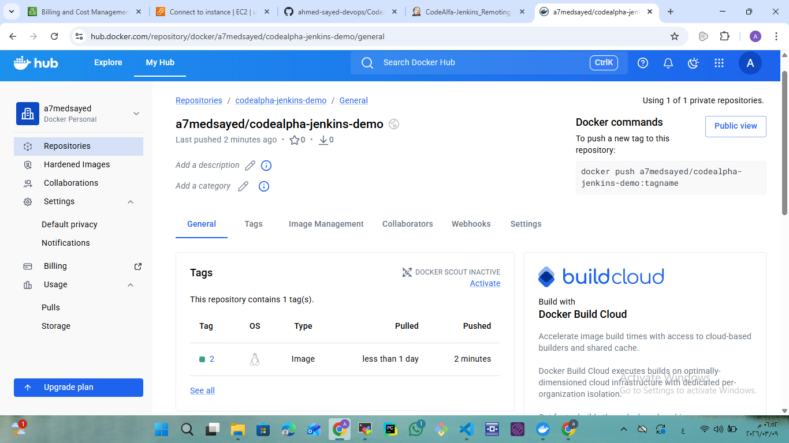               |
| 16   | Docker container running on the server                              | 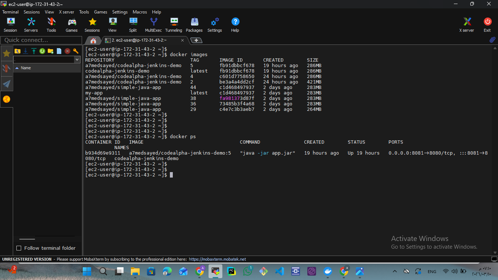              |
| 17   | Slack notification for pipeline status                              | 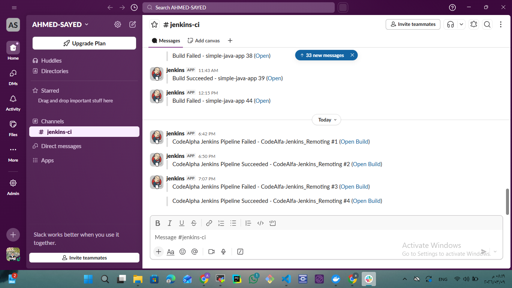       |
| 18   | Accessing deployed application from browser                         | 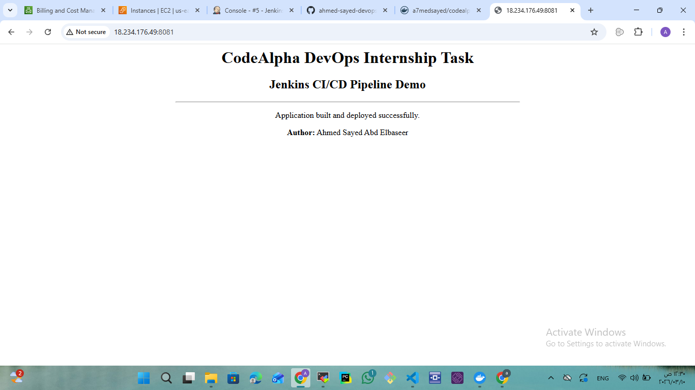               |

---

# ▶ How to Run the Application

1. Clone the repository

```
git clone https://github.com/ahmed-sayed-devops/CodeAlpha_tasks.git
```

2. Navigate to the project directory

```
cd CodeAlpha_Jenkins_Remoting_CICD
```

3. Build the Docker image

```
docker build -t codealpha-jenkins-demo .
```

4. Run the container

```
docker run -d -p 8081:8080 codealpha-jenkins-demo
```

5. Access the application

```
http://SERVER_PUBLIC_IP:8081
```

---

# 🐳 Docker Image

DockerHub Repository:

```
a7medsayed/codealpha-jenkins-demo
```

---

# 🔔 Slack Notification

The pipeline sends automatic notifications to Slack channel **#jenkins-ci** when:

* Build succeeds
* Build fails

---

# 👨‍💻 Author

Ahmed Sayed Abd Elbaseer

GitHub
https://github.com/ahmed-sayed-devops

LinkedIn
https://www.linkedin.com/in/ahmed-sayed-devops

---

# 📜 License

This project is part of the **CodeAlpha DevOps Internship Program**.
